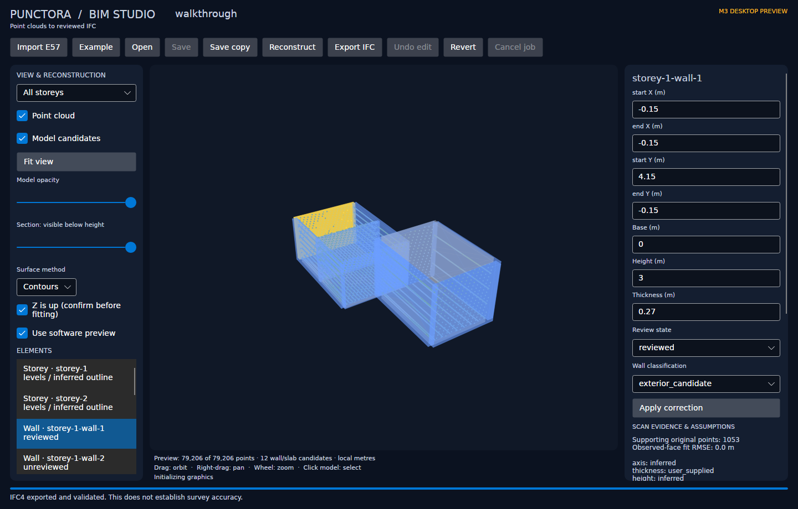

# M3 desktop verification

Recorded 2026-10-08. Initial desktop implementation is ready for Windows preview testing. Linux and Windows CI review/export checks are verified; testing on the user's physical Windows/AMD machine remains pending. This is not a claim of survey accuracy or a completed installer.



## Implemented workflow

- .NET 10 / Avalonia 12.1.3 desktop with E57 import, generated example, open, reconstruct, save, save-copy, undo/revert, export and cancellation.
- Isolated Python jobs using protocol 1 with job IDs, progress, structured errors and stderr diagnostics. Cancellation kills/waits for the process tree, releases OS locks and recovers the authoritative saved revision while retaining an unchanged draft.
- Automatic OpenGL/ANGLE point/mesh viewport, renderer/vendor reporting, context-failure recovery, forced software preview, orbit/pan/zoom/fit, cloud/model toggles, opacity, storey filtering, vertical section and element picking.
- Wall endpoint/base/height/thickness/classification edits; slab base/thickness edits; storey name/elevation/ceiling edits with dependent geometry updates. Invalid dimensions and overlapping storeys are rejected.
- Unreviewed/reviewed/flagged/rejected states, explicit user-supplied correction provenance, retained observed faces and original-record evidence. Fit RMSE refers to the original fit, not a newly verified correction.
- Schema-1 `.punctora` projects with immutable generations, owned assets, safe relative paths, advisory OS locks, revision checks, atomic saves and portable copies. Project/element identity and IFC root GUIDs survive reopening/copying/display-name changes.
- Edited IFC4 export through the existing validator. Rejected candidates are excluded; stale inferred spaces are omitted after geometry edits. Remaining unreviewed/flagged geometry is reported explicitly. Wall and slab review states are retained in IFC properties.
- Windows preview packaging script, pinned NuGet graph, exact Windows wheel/archive hashes, retained Python/.NET/native notices and application-local C++ runtime. The bundled Python libraries remain replaceable.

## Automated evidence

Verified code revision: [`4b9be0d`](https://github.com/ManethonSega/Punctora-BIM-Studio/commit/4b9be0ddbdf517de093cb59a5dfcc909ef55549d). The [core CI run](https://github.com/ManethonSega/Punctora-BIM-Studio/actions/runs/37822331692) passed all **89 tests** in each of four jobs: Windows and Ubuntu, each with Python 3.11 and 3.12. The [desktop CI run](https://github.com/ManethonSega/Punctora-BIM-Studio/actions/runs/37822331484) passed Release builds, Linux OpenGL/software walkthroughs, the Windows software walkthrough and bundled Windows worker checks.

[Download the verified Windows preview](https://github.com/ManethonSega/Punctora-BIM-Studio/actions/runs/37822331484/artifacts/11570745096). Extract the artifact, then extract its contained ZIP and run **Punctora.Desktop.exe** with all extracted files kept together. GitHub sign-in is required for artifact downloads; this artifact expires on 2027-01-06. Its archive SHA-256 is `a2fd646e240ddc8c45fe3d29749828126672f9b0614400309eabd10d486ed60f`. This is the corrected preview; use it in preference to the earlier `b62bbba` build.

The test suite contains **89 tests**: 74 previous core regressions and 15 project/worker regressions. Project checks cover edit/save/reopen/copy/export, retained evidence, stable IFC IDs, rejected geometry, invalid/nonfinite edits, overlapping storeys, stale revisions, a simulated failed atomic replacement, path escape, real worker termination during reconstruction, lock release, cleanup, malformed protocol, resuming an interrupted copy, and releasing mapped ndarray views before Windows directory publication.

Release desktop builds complete with zero warnings/errors. Automated desktop walkthroughs create a two-storey model, exercise ray picking/inspector selection, correct wall thickness to **0.27 m**, mark it reviewed, save, reopen and export validated IFC. Camera updates and PNG capture exercise both renderer modes. Linux automation uses Xvfb and Mesa llvmpipe (LLVM 20.1.2, 256 bits), not a physical graphics card. The window is 1440×920; the viewport is 845×697.

Reports:

- [OpenGL walkthrough](benchmarks/m3-desktop-opengl.json)
- [Forced software walkthrough](benchmarks/m3-desktop-software.json)
- [Pump preview](benchmarks/m3-pump-preview.json) and [import timing](benchmarks/m3-pump-import.json)
- [Station018 preview](benchmarks/m3-station018-preview.json) and [import timing](benchmarks/m3-station018-import.json)

| Supplied scan | Original valid points | Display samples | Import + preview preparation | Saved-project loading |
| --- | ---: | ---: | ---: | ---: |
| pumpNoInvalidPoints.e57 | 1,213,990 | 100,000 | 0.80 s | 0.94 s |
| Station018.e57 | 4,067,815 | 100,000 | 2.69 s | 1.05 s |

These are single local warm-filesystem measurements, not performance promises. Project loading includes starting a worker and loading scene data; it does not measure time until the first displayed frame. Both previews were rendered and camera-updated through Mesa OpenGL. Missing CRS/datum warnings, the pump's missing pose, original source record mapping and source integrity are preserved. These supplied examples are import/view tests; accepted architectural reconstruction has not been established.

The 100,000-point OpenGL buffer uses **2,800,000 bytes** of XYZ/RGBA floats; mesh buffers are reported separately. This is uploaded buffer size, not measured resident VRAM. Reports record CPU drawing/submission callback timings; they exclude GPU completion/composition and must not be converted into an FPS or GPU speedup claim. Hardware frame times, driver behavior and actual residency remain target-machine measurements.

## Reproduce

```sh
python -m pip install -e ".[test]" -c requirements-core.txt
python -m pytest -q
dotnet restore desktop/Punctora.Desktop/Punctora.Desktop.csproj --locked-mode
dotnet build desktop/Punctora.Desktop/Punctora.Desktop.csproj -c Release --no-restore
dotnet desktop/Punctora.Desktop/bin/Release/net10.0/Punctora.Desktop.dll --verify-ui outputs/m3-gl
dotnet desktop/Punctora.Desktop/bin/Release/net10.0/Punctora.Desktop.dll --software --verify-ui outputs/m3-software
python scripts/check_desktop_verification.py outputs/m3-gl outputs/m3-software
python scripts/package_desktop.py
```

On headless Linux, prefix desktop commands with `xvfb-run -a`; set `LIBGL_ALWAYS_SOFTWARE=1` when deliberately exercising Mesa's software renderer. To check a previously imported scan project, use `--verify-preview path.punctora outputs/preview`. Test modes create files in the selected output folder and must use new filenames.

The [desktop CI workflow](../.github/workflows/desktop.yml) builds on Linux/Windows, verifies desktop correction/export, runs the embedded Windows worker and uploads a portable preview. CI success is recorded by the workflow run, not inferred from the local cross-build. The package is built from pinned wheels; Linux cannot execute the Windows embedded interpreter.

## Acceptance and follow-up

1. Run the Windows preview on the user's RX 7800 XT, verify the reported hardware renderer, orbit/section/picking and cancellation, then measure responsiveness and memory on representative building crops. Linux software OpenGL is not AMD acceptance.
2. Compare edited IFC in an independent viewer and review an annotated real building against reference dimensions. Both are still open.
3. Extend fixed preview sampling to view-dependent streaming and add arbitrary box crops as larger-scene review needs are established. Current limits are 100,000 OpenGL samples, 5,000 software samples and a vertical section/storey filter.
4. M4 adds whole-cloud deviation/coverage reporting and clean-machine installer acceptance. Original-fit RMSE, user review states and schema validity stay distinct from measured survey acceptance.
5. Profile CPU conversion by stage before implementing bounded multicore orchestration and a compatible GPU compute backend. Conversion remains CPU-only; the renderer is a separate acceleration path. R13 in the requirements and the M3 acceleration plan remain open.

The research-informed boundary is preserved: observations and original evidence are separate from edited/inferred proposals; explicit unknowns remain unknown; rejected proposals do not enter the reviewed export. SpatialLM/Pointcept/GPT4Point and other research code/weights are not integrated into M3.

Windows CI identified an initial E57 publication failure caused by live NumPy views retaining mapped-file handles. The follow-up fix walks the array base chain to close the owning mapping before directory publication and adds a focused regression. The graphics depth buffer is also reallocated when a context is initialized again.

## 0.3.0a2 export correction (2026-10-09)

The user reported successful E57 import and wall/slab/storey detection, followed by `No module named _pytest` during immediate IFC export. This was reproduced in a core installation without test extras. IfcOpenShell 0.8.3 imports `_pytest.assertion` at runtime when executing EXPRESS rules, although its wheel metadata does not declare pytest. The previous bundled-worker check created a demo but did not export IFC; developer tests masked the missing dependency.

The core now declares pytest 8.4.2 as a runtime dependency. Its transitive packages are pinned, hashed and attributed with complete wheel notices. Validation remains enabled. The package verification now uses the embedded interpreter in isolated mode, from outside the repository, to detect elements, export immediately, reopen the IFC and reject invalid space containment. Core CI also runs that workflow without installing test extras.

The desktop buttons now read **Detect elements** and **Convert to IFC**. Conversion first detects elements if the project has no model, subject to the existing Z-up confirmation. Existing projects and their assets remain compatible. Automatic door/window detection and coordinated multicore/GPU conversion are still open work. A low overall CPU percentage does not by itself establish a bottleneck: sampling, storey processing and wall-evidence loops are sequential, and region-growing neighbour queries explicitly use one worker. Stage profiling is needed before selecting parallel work.

The original 0.3.0a1 artifact above is historical and contains the reported export packaging defect. Use the corrected 0.3.0a2 artifact from its successful desktop workflow run.
